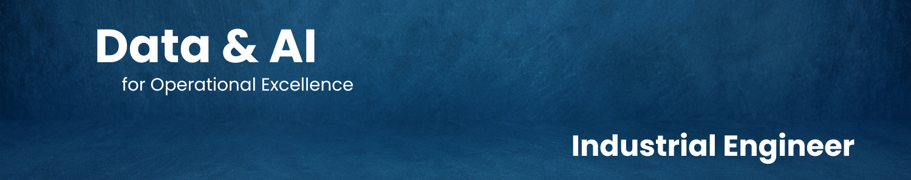

<div align="center">
  <h1>Hello! 👋 I'm Juan Pablo</h1>
  <h3>Industrial Engineer | Data Science & AI</h3>
  <p>
    <em>Bridging the gap between operational needs and technical solutions.</em>
  </p>

  <a href="https://linkedin.com/in/rizzijp">
    
  </a>
  <a href="mailto:rizzijpr@gmail.com">
    
  </a>
</div>

<hr />

### 🚀 About Me

I am an **Industrial Engineer** passionate about digital transformation and applying technology to process improvement. I recently completed a Data Science & AI Bootcamp (Dec 2025) to acquire the technical tools needed to solve complex business problems.

**My value proposition: Optimizing business processes by combining Industrial Engineering logic with Data Science & AI.**

```python
class Profile:
    def __init__(self):
        self.name = "Juan Pablo"
        self.role = "Industrial Engineer & Data Scientist"
        self.language = ["Spanish (Native)", "English (Advanced)"]

    def technical_interests(self):
        return [
            "Generative AI & LLMs",
            "RAG & Semantic Search",
            "AI Agents & Orchestration",
            "Process Automation"
        ]
```

- 🔭 **Currently working on:** An **NL-to-SQL Chatbot**, a context-aware AI application designed to democratize business data accessibility using Natural Language.
- 🎯 **Focus:** Designing and building AI-driven applications that automate complex business workflows and drive operational efficiency.
- 💼 **Open to roles in: Data Analytics, Data Science and Process Automation**.

---

### 🛠️ Tech Stack & Tools

<table align="center">
  <tr>
    <td align="center" width="33%"><strong>🧠 Core Data & Analysis</strong></td>
    <td align="center" width="33%"><strong>🤖 Machine Learning & AI</strong></td>
    <td align="center" width="33%"><strong>🚀 Deployment & MLOps</strong></td>
  </tr>
  <tr>
    <td align="center">
      
      
      <br>
      
      
    </td>
    <td align="center">
      
      
      <br>
      
      
    </td>
    <td align="center">
      
      
      <br>
      
      
    </td>
  </tr>
</table>

---

### 🚀 Featured Projects

| Project                                                                            | Description                                                                                      | Stack                       |
| :--------------------------------------------------------------------------------- | :----------------------------------------------------------------------------------------------- | :-------------------------- |
| **🤖 [NL-to-SQL Chatbot](https://github.com/rizzijp/botassistant)**                | (In progress) AI Assistant that allows non-tech users to query databases using natural language. | LLMs, FastAPI, Streamlit    |
| **🌌 [Galaxy Classifier](https://github.com/rizzijp/galaxy-classifier)**           | End-to-end MLOps pipeline to classify galaxy images. API serving with persistence.               | TensorFlow, Flask, Docker   |
| **⚙️ [Predictive Maintenance](https://github.com/rizzijp/predictive-maintenance)** | Machine Learning model to predict CNC machine failures with a real-time dashboard.               | Python, LightGBM, Streamlit |
| **📧 [Email Analytics Report](https://github.com/rizzijp/emails-report)**          | Automated script to process and structure data from raw emails.                                  | Python, Regex, JSON         |

### 📫 Let's Connect!

I love collaborating on interesting projects and connecting with fellow engineers and data enthusiasts. If you have an idea, a project, or just want to chat about Data and AI, feel free to reach out!

<div align="center">

[](https://www.linkedin.com/in/rizzijp/)
[](mailto:rizzijpr@gmail.com)

</div>

---

<div align="center">

### 💡 _"Data is valuable only when it translates into better decisions."_

⭐️ If you find any of my projects useful, feel free to give them a star!

</div>

<!--
**rizzijp/rizzijp** is a ✨ _special_ ✨ repository because its `README.md` (this file) appears on your GitHub profile.

Here are some ideas to get you started:

- 🔭 I’m currently working on ...
- 🌱 I’m currently learning ...
- 👯 I’m looking to collaborate on ...
- 🤔 I’m looking for help with ...
- 💬 Ask me about ...
- 📫 How to reach me: ...
- 😄 Pronouns: ...
- ⚡ Fun fact: ...
-->
